# JIRA Magic Library (JML) – Architecture Document

**Owner(s):** Development Team | **Reviewers:** TBD | **Last updated:** 2025-10-02  
**Status:** Draft for MVP (JIRA Server/DC only)

---

## 1. Executive Summary

### Problem & Context
- Developers integrating with JIRA need to know field IDs, option IDs, exact payload structures, and API differences between Server/DC and Cloud
- Manual JIRA API integration requires brittle, instance-specific hardcoded mappings
- Bulk operations (CSV imports, migrations) require custom parsing and batching logic
- Schema changes break integrations; no dynamic discovery pattern exists

### Primary Decision
Build a **schema-driven Node.js library** that dynamically discovers JIRA metadata (fields, types, options) via API and converts human-friendly input (e.g., `"Priority": "High"`) into valid JIRA payloads—no hardcoded mappings.

### Goals
1. Enable issue creation with human-readable JSON/YAML/CSV (e.g., field names, not IDs)
2. Support bulk operations (50+ issues) with batching and error recovery
3. Work with JIRA Server/DC API v2 (MVP); extend to Cloud v3 later
4. Cache schema to minimize API calls (< 1 schema fetch per 15 minutes under normal load)
5. Distribute as npm package; design for future Python SDK

### Non-Goals (MVP)
- JIRA Cloud API v3 support (Epic 8)
- Python SDK (Epic 9)
- Advanced issue search/JQL builder
- Webhook/event processing
- UI components or web dashboard

### Architecture Thumbnail
```
User Code → JML Library → [Schema Cache (Redis)] → JIRA Server API v2
                ↓
         Converter Registry (type-based, not field-based)
```

**Field Type Conversion**: See [JIRA Field Types Reference](../JIRA-FIELD-TYPES.md) for complete list of 20+ JIRA types and conversion patterns.

### Success Criteria
- **Performance**: < 2s for single issue creation (including schema discovery on cold start); < 500ms for cached schema
- **Reliability**: 95% of valid inputs succeed on first attempt; clear error messages for remaining 5%
- **API efficiency**: < 5 JIRA API calls per issue creation (schema, user/component lookups, issue POST)
- **Adoption**: Library usable with < 10 lines of user code for basic issue creation

---

## 2. Requirements & Constraints

### Functional Requirements
1. **F1**: Accept issue data in JSON, YAML, or CSV with human-readable field names (e.g., "Priority", "Assignee")
2. **F2**: Dynamically discover project schemas, issue types, fields, and valid options via JIRA API
3. **F3**: Convert field values (e.g., "High" → `{id: "1"}`) based on discovered field types
4. **F4**: Support multiple date formats: ISO 8601 strings (`"2025-09-30"`) and Excel serial dates (`45744` = days since 1900-01-01)
5. **F5**: Create single issues via `jml.issues.create()`
6. **F6**: Create bulk issues (10–1000) via `jml.issues.createMany()` with batching
7. **F7**: Update existing issues via `jml.issues.update()`
8. **F8**: Transition issues through workflows via `jml.issues.transition()`
9. **F9**: Handle ambiguous inputs (e.g., two components named "Backend") with clear error messages and candidate lists
10. **F10**: Support dry-run validation mode (return payload without API call)
11. **F11**: Cache schema and lookup data (fields, users, components) in Redis

### Quality Attributes & Targets
| Attribute | Target | Measurement |
|-----------|--------|-------------|
| **Latency (p95)** | < 2s cold start, < 500ms warm | Time from `create()` call to API response |
| **API Efficiency** | < 5 JIRA calls per issue create | Count API requests (schema + lookups + POST) |
| **Cache Hit Rate** | > 90% for schema lookups | Redis hit/miss ratio over 1 hour |
| **Error Clarity** | 100% of errors include actionable message | Manual review of error samples |
| **Bulk Throughput** | > 20 issues/sec (batched) | Time to create 100 issues |
| **Memory Usage** | < 100MB for typical workflow | Node.js heap size during bulk operations |
| **Redis Memory** | < 10MB per JIRA instance | Redis memory usage for cached schemas |

### Hard Constraints
- **C1**: Must support JIRA Server/DC API v2 (tested against JIRA 8.x)
- **C2**: Must NOT hardcode field IDs, option IDs, or field types
- **C3**: PAT authentication only for MVP (username/password deprecated by Atlassian)
- **C4**: Redis required for caching (no embedded cache for MVP)
- **C5**: Node.js 18+ (LTS); TypeScript for type safety
- **C6**: Distributed as npm package; must work in CommonJS and ESM projects
- **C7**: Zero runtime dependencies on browser APIs (must work in Node.js only for MVP)
- **C8**: Minimize external dependencies; prefer Node.js built-ins (fetch, fs, events, streams)

### Runtime Dependencies (Decision Matrix)
| Feature | Native Option | Library Option | Decision | Rationale |
|---------|---------------|----------------|----------|-----------|
| **HTTP Client** | `fetch` (Node 18+) | `axios`, `got` | ✅ Native | Fetch is sufficient; retry logic is trivial; avoids 500KB+ dependency |
| **Redis Client** | ❌ None | `ioredis` | ✅ Library | Redis protocol is complex; `ioredis` is battle-tested, well-maintained |
| **YAML Parsing** | ❌ None | `js-yaml` | ✅ Library | YAML spec is complex; `js-yaml` is standard, 50KB gzipped |
| **CSV Parsing** | String split + regex | `csv-parse` | ✅ Library | Edge cases (quotes, escapes, multiline) are hard; `csv-parse` is stream-based, 20KB |
| **Env Variables** | `process.env` | `dotenv` | ✅ Library | `.env` file parsing is non-trivial (comments, multiline, quotes); `dotenv` is 10KB, ubiquitous |
| **JSON Parsing** | `JSON.parse` | - | ✅ Native | Built-in is perfect |
| **File I/O** | `fs/promises` | - | ✅ Native | Built-in is perfect |
| **Events** | `EventEmitter` | - | ✅ Native | Built-in is perfect |
| **Date Parsing** | `new Date()` + Excel serial | `date-fns`, `dayjs` | ✅ Native | Support ISO 8601 + Excel serial dates (days since 1900-01-01); conversion formula is trivial |
| **Validation** | Manual checks | `zod`, `joi` | ⚠️ TBD | Manual validation for MVP; consider schema library if complexity grows |

**Total external dependencies: 4** (`ioredis`, `js-yaml`, `csv-parse`, `dotenv`)  
**Avoided bloat**: ~2MB (axios + date library + validation library)

### Module Format Decision

**Decision**: Library outputs **CommonJS** format, consumable by both CommonJS and ESM projects.

**Rationale**:
- TypeScript compiler (`tsc`) outputs CommonJS by default (`"module": "commonjs"` in tsconfig.json)
- Node.js v18+ provides **native ESM/CJS interop**: ESM modules can import named exports from CommonJS modules
- Demo app (ESM) successfully imports library exports: `import { JML, loadConfig } from 'jira-magic-library'` ✅
- Converting to pure ESM would require:
  - Adding `.js` extensions to all 200+ TypeScript imports
  - Updating all tests and tooling
  - Potentially breaking compatibility with older Node.js versions
  - Estimated effort: 4-8 hours with 237 import statements to fix

**Implementation**:
- `package.json`: No `"type": "module"` field (defaults to CommonJS)
- `tsconfig.json`: `"module": "commonjs"`, `"moduleResolution": "node"`
- Compiled output: `dist/index.js` uses `exports.FunctionName = ...` (CommonJS)
- ESM consumers: Node.js automatically provides named export interop

**Compatibility**:
- ✅ CommonJS projects: `const { JML } = require('jira-magic-library')`
- ✅ ESM projects: `import { JML } from 'jira-magic-library'`
- ✅ TypeScript: Both module systems work with `.d.ts` type definitions

**Future Consideration**: Dual module output (CommonJS + ESM) can be added later if needed, but current CommonJS-only approach meets all requirements with zero compatibility issues.

---

## 3. Component Architecture

### Component Diagram (C4 - Container Level)


### 1. **Configuration & Auth Layer**
**Purpose**: Load and validate connection settings; manage PAT authentication.

**Key Decisions**:
- Use environment variables (`.env` file) for PAT and JIRA URL (prevents credential leaks in code)
- Validate connection on initialization by testing `/serverInfo` endpoint
- Store PAT in memory only (never persist to disk)

**Interfaces**:
```typescript
interface JMLConfig {
  baseUrl: string;              // e.g., "https://jira.company.com"
  auth: { token: string };      // PAT token
  apiVersion?: "v2" | "v3";     // Default: "v2" for Server/DC
  redis: { host: string; port: number; password?: string };
  cache?: { ttlSeconds: number }; // Default: 900 (15 min)
}
```

**Error Handling**:
- Throw `ConfigurationError` if baseUrl or PAT missing
- Throw `AuthenticationError` if PAT invalid (401 from JIRA)
- Retry connection test once after 1s delay

### 2. **JIRA API Client**
**Purpose**: Abstraction layer for all HTTP communication with JIRA; handles retries, rate limiting, and error normalization.

**Key Decisions**:
- Use native `fetch` (Node.js 18+) for HTTP (zero dependencies for HTTP client)
- Implement request wrapper for auth headers and response error handling
- Retry transient errors (429, 503) with exponential backoff (1s, 2s, 4s max)
- Rate limit: max 10 concurrent requests to JIRA (configurable via semaphore pattern)
- Normalize JIRA error responses into library-specific error types

**Interfaces**:
```typescript
interface JiraClient {
  get<T>(path: string, params?: object): Promise<T>;
  post<T>(path: string, body: object): Promise<T>;
  put<T>(path: string, body: object): Promise<T>;
}

// Implementation uses native fetch
class JiraClientImpl implements JiraClient {
  private async request<T>(method: string, path: string, options?: RequestInit): Promise<T> {
    const response = await fetch(`${this.baseUrl}${path}`, {
      method,
      headers: {
        'Authorization': `Bearer ${this.token}`,
        'Content-Type': 'application/json',
        ...options?.headers,
      },
      ...options,
    });
    
    if (!response.ok) {
      // Parse JIRA error and throw normalized error
      throw await this.handleError(response);
    }
    
    return response.json();
  }
}
```

**Endpoints Used (MVP)**:
- `GET /serverInfo` - Validate connection, detect API version
- `GET /project` - List projects
- `GET /project/{key}` - Project details
- `GET /issuetype` - List issue types
- `GET /field` - List all fields (system + custom)
- `GET /issue/{key}/editmeta` - Get editable fields for issue
- `GET /issue/createmeta` - Get createable fields for project/issuetype
- `POST /issue` - Create issue
- `PUT /issue/{key}` - Update issue
- `POST /issue/{key}/transitions` - Transition issue
- `GET /priority` - List priorities
- `GET /project/{key}/components` - List components
- `GET /project/{key}/versions` - List versions
- `GET /user/search` - Search users by email/name

**Error Handling**:
- 401/403 → `AuthenticationError`
- 404 → `NotFoundError`
- 429 → Retry with backoff, throw `RateLimitError` after 3 attempts
- 500/503 → Retry, throw `JiraServerError` after 3 attempts

### 3. **Schema Discovery & Caching**
**Purpose**: Query JIRA for metadata (fields, issue types, options) and cache in Redis to minimize API calls.

**Key Decisions**:
- Cache at project + issue type granularity (different projects have different fields)
- TTL: 15 minutes (balance between freshness and API load)
- Auto-invalidate on JIRA errors suggesting schema change (e.g., field not found)
- Lazy loading: fetch schema on first use, not at initialization

**Cache Keys**:
```
jml:schema:{baseUrl}:{projectKey}:{issueType}  → field definitions
jml:priorities:{baseUrl}                       → priority options
jml:components:{baseUrl}:{projectKey}          → component list
jml:versions:{baseUrl}:{projectKey}            → version list
jml:users:{baseUrl}:{query}                    → user search results (TTL: 5 min)
```

**Cache Invalidation**:
- TTL-based expiration (passive)
- Force refresh if JIRA returns 400 with "field does not exist" error
- Manual `jml.clearCache()` method for users

**Schema Structure** (cached object):
```typescript
interface FieldSchema {
  id: string;                    // "customfield_10024" or "priority"
  name: string;                  // "Story Points" or "Priority"
  type: string;                  // "number", "option", "user", etc.
  required: boolean;
  allowedValues?: Array<{id: string; name: string}>; // For selects, priorities
  schema: { type: string; custom?: string }; // JIRA's schema object
}
```

### 4. **Field Resolution & Conversion Engine**

This engine transforms human-friendly input into JIRA API payloads through two main processes:

#### A. Field Name Resolution
- User provides: `"Priority": "High"`
- Engine queries schema (from Component 3) to find field with display name "Priority"
- Resolves to field key (e.g., `"priority"`) or custom field ID (e.g., `"customfield_10024"`)
- No hardcoded mappings; all discovered dynamically from JIRA

#### B. Value Conversion (Type-Based)
Based on the field's **type** (from `fieldSchema.type`), converts user values to JIRA-required structures. **Conversion is type-driven, never field-name based.**

**JIRA Field Type Examples** (see [Field Types Reference](../JIRA-FIELD-TYPES.md) for complete list):

**Simple Types** (no lookup):
- **`type: "string"`**: `"Fix login bug"` → `"Fix login bug"` (passthrough)
- **`type: "number"`**: `"3.5"` → `3.5` (parse float)
- **`type: "date"`**: `"2025-09-30"` → `"2025-09-30"` (ISO string)
- **`type: "date"`**: `45744` (Excel serial) → `"2025-03-15"` (ISO string)
- **`type: "datetime"`**: `"2025-09-30T14:30:00"` → ISO with timezone

**Lookup Types** (query JIRA for ID):
- **`type: "priority"`**: `"High"` → Query priorities → `{id: "1"}`
- **`type: "user"`**: `"alex@example.com"` → Query user API → `{name: "alex"}` or `{accountId: "..."}` (Server vs Cloud)
- **`type: "option"`**: `"Production"` → Query custom field options → `{id: "10100"}`

**Array Types** (container with item type):
- **`type: "array", items: "string"`**: `"safari, frontend"` → `["safari", "frontend"]` (labels)
- **`type: "array", items: "component"`**: `["Backend", "API"]` → `[{id: "10001"}, {id: "10002"}]`
- **`type: "array", items: "version"`**: `["v1.0", "v2.0"]` → `[{id: "10200"}, {id: "10201"}]`

**Complex Types** (nested structures):
- **`type: "option-with-child"`**: `"Hardware -> Keyboard"` → `{value: "10100", child: {value: "10101"}}`
- **`type: "timetracking"`**: `"3h 30m"` → `{originalEstimate: "3h 30m"}`

#### C. Converter Registry (Type-Based)
- Each **JIRA field type** has a converter function registered by type string:
  - `registry.register('priority', convertPriorityType)`
  - `registry.register('user', convertUserType)`
  - `registry.register('date', convertDateType)`
  - `registry.register('array', convertArrayType)` (container that delegates to item converters)
- Converters are **never** keyed by field name (no field-specific logic)
- Lookup occurs via: `converter = registry.get(fieldSchema.type)`
- Custom converters can be registered: `jml.registerConverter('my-custom-type', myConverter)`
- Extensibility: Users can override built-in converters for custom behavior

#### D. Validation Strategy

**Architecture Decision (October 2025)**: JIRA validates, we convert.

- **No pre-validation**: Library converts formats only, does not validate payloads
- **JIRA is source of truth**: JIRA API validates all fields, constraints, and business rules
- **Error handling**: JIRA validation errors passed through with clear context
- **Benefits**: Simpler code, no hardcoded rules, works with any JIRA version/configuration

**Rationale**: Pre-validation added ~2,500 lines of complexity with hardcoded transformation rules. JIRA already validates perfectly, making local validation redundant and error-prone (schema drift, version differences).

**Previous approach** (E3-S10/E3-S12, archived in `archive/e3-s10-universal-validator`):
- Built UniversalValidator with JSON Schema (Ajv)
- Validated payloads before JIRA API calls
- Removed due to complexity vs benefit ratio

### 5. **Issue Operations Module**
**Purpose**: High-level API for creating, updating, and transitioning issues.

**Public API**:
```typescript
class IssueOperations {
  create(input: Record<string, any>, options?: { validate?: boolean }): Promise<Issue>;
  createMany(input: { from?: string; data?: any; format?: "csv"|"json"|"yaml" }): Promise<BulkResult>;
  update(key: string, input: Record<string, any>): Promise<Issue>;
  updateMany(match: {keys: string[]} | {jql: string}, set: Record<string, any>): Promise<BulkResult>;
  transition(key: string, toStatus: string, fields?: Record<string, any>): Promise<Issue>;
}
```

**Key Flows**:
1. Parse user input (JSON/YAML/CSV)
2. Resolve field names to IDs via Schema Discovery
3. Convert values via Field Conversion Engine
4. Send to JIRA API (JIRA validates)
5. Return result or actionable error

**Error Handling**:
- Return `AmbiguityError` with candidate list (e.g., two "Backend" components)
- Wrap JIRA API errors with context (which field caused the error)
- Pass through JIRA validation errors clearly to user

### 6. **Bulk Processor**
**Purpose**: Handle multi-record inputs with batching, concurrency control, and partial failure recovery.

**Key Decisions**:
- Batch size: 50 issues per batch (tunable)
- Concurrency: 4 parallel batches (tunable; limited by JIRA rate limits)
- Fail-fast: NO; process all batches and return per-row results
- Transaction model: NONE (JIRA has no bulk transaction API); each issue is independent

**Batching Strategy**:
```
Input: 237 issues
Split: [50, 50, 50, 50, 37] = 5 batches
Process: 4 batches in parallel, then 1 remaining
```

**Result Format**:
```typescript
interface BulkResult {
  total: number;
  succeeded: number;
  failed: number;
  results: Array<{
    index: number;
    success: boolean;
    key?: string;        // JIRA issue key if created
    error?: Error;       // Error details if failed
  }>;
}
```

### 7. **CLI Interface** (Epic 7)
**Purpose**: Command-line tool for users who prefer terminal workflows.

**Design**: Thin wrapper around library; uses same modules.
```bash
jml create --from tickets.csv --project ENG
jml update --jql "project=ENG AND status=Open" --set "Priority=High"
```

### 8. **Extensibility Layer**
**Purpose**: Allow users to register custom converters for custom field types or special parsing rules.

**API**:
```typescript
interface Converter {
  (input: any, fieldSchema: FieldSchema, context: ConversionContext): any;
}

jml.registerConverter("com.acme.geo-location", (input) => {
  const [lat, lon] = input.split(",");
  return { lat: parseFloat(lat), lon: parseFloat(lon) };
});
```

---

## 4. Critical Data Flows

### Flow 1: Single Issue Creation (Happy Path)

**Expected Latency**: < 500ms (warm cache), < 2s (cold cache)

### Flow 2: Bulk Creation (100 Issues from CSV)

```mermaid
sequenceDiagram
    participant User
    participant JML
    participant Cache
    participant JIRA

    User->>JML: createMany({from: "tickets.csv"})
    JML->>JML: Parse CSV → 100 records
    JML->>Cache: Get schema (once)
    Cache-->>JML: Schema
    JML->>JML: Split into 2 batches [50, 50]
    
    par Batch 1 (50 issues)
        loop 50 issues
            JML->>JML: Convert fields
        end
        JML->>JIRA: POST /issue (×50, serially)
        JIRA-->>JML: 50 responses
    and Batch 2 (50 issues)
        loop 50 issues
            JML->>JML: Convert fields
        end
        JML->>JIRA: POST /issue (×50, serially)
        JIRA-->>JML: 50 responses
    end
    
    JML->>JML: Aggregate results
    JML-->>User: {total:100, succeeded:98, failed:2, results:[...]}
```

**Expected Latency**: ~5s for 100 issues (50ms per issue POST, 2 parallel batches)

### Flow 3: Ambiguity Resolution (Two Components Named "Backend")


---

## 5. Interfaces & Data Contracts

### Public API (TypeScript)
See **Component Architecture > Issue Operations Module** for method signatures.

### JIRA API Endpoints (v2 - Server/DC)
| Method | Endpoint | Purpose | Rate Limit Notes |
|--------|----------|---------|------------------|
| GET | `/rest/api/2/serverInfo` | Validate connection | Unlimited |
| GET | `/rest/api/2/field` | Get all fields | Cache 15min |
| GET | `/rest/api/2/issue/createmeta` | Get createable fields | Cache per project+issuetype |
| POST | `/rest/api/2/issue` | Create issue | ~100/min typical |
| PUT | `/rest/api/2/issue/{key}` | Update issue | ~100/min typical |
| GET | `/rest/api/2/priority` | Get priorities | Cache 15min |
| GET | `/rest/api/2/project/{key}/components` | Get components | Cache 15min |
| GET | `/rest/api/2/user/search?query={email}` | Find user | Cache 5min |

**Versioning Strategy**: All endpoints use `/rest/api/2/` for Server/DC. Cloud support (Epic 8) will add `/rest/api/3/` with adapter layer.

### Redis Cache Schema
See **Component Architecture > Schema Discovery & Caching** for cache key patterns.

### Error Response Format
All library errors extend base `JMLError`:
```typescript
class JMLError extends Error {
  code: string;          // "VALIDATION_ERROR", "AMBIGUITY_ERROR", etc.
  details?: object;      // Field-specific context
  jiraResponse?: object; // Raw JIRA error if applicable
}
```

---

## 6. Operational Model

### Integration (How Users Consume the Library)
1. **Install**: `npm install jira-magic-library`
2. **Configure**: Create `.env` file or pass config object
3. **Initialize**: `const jml = new JML(config);`
4. **Use**: `await jml.issues.create({...});`

### Redis Deployment
- Users must provide Redis instance (not bundled)
- Recommended: Local Redis for dev, managed Redis (AWS ElastiCache, Redis Cloud) for prod
- Memory estimate: 5-10MB per JIRA instance (schemas, lookups)
- No persistence required (cache is ephemeral)

### Error Handling & Retries
| Error Type | Retry? | User Action |
|------------|--------|-------------|
| `ConfigurationError` | No | Fix config (PAT, URL) |
| `AuthenticationError` | No | Check PAT validity |
| `ValidationError` | No | Fix input data |
| `AmbiguityError` | No | Provide explicit ID or unique name |
| `RateLimitError` | Yes (3×) | Wait or reduce concurrency |
| `JiraServerError` (500/503) | Yes (3×) | Check JIRA status; retry later |
| `NetworkError` | Yes (3×) | Check network/firewall |

### Observability (For Library Users)
Library emits events users can subscribe to:
```typescript
jml.on("api-call", (method, path, duration) => { /* log to DataDog, etc. */ });
jml.on("cache-hit", (key) => { /* track cache efficiency */ });
jml.on("cache-miss", (key) => { /* alert if cache not working */ });
jml.on("error", (error) => { /* send to error tracker */ });
```

**Recommended Metrics**:
- API call count & latency (by endpoint)
- Cache hit/miss ratio
- Error rate by type
- Bulk operation throughput (issues/sec)

### Capacity Planning
**Single Issue Creation**:
- Cold start: 1 schema fetch + 1-3 lookups + 1 POST = 3-5 API calls (~1.5s)
- Warm cache: 0-1 lookups + 1 POST = 1-2 API calls (~300ms)

**Bulk (100 issues)**:
- Schema/lookups: 5 API calls (shared across batch)
- Issue POSTs: 100 API calls
- Total: ~105 calls over ~5-10s (depends on concurrency & JIRA rate limits)

**Redis Memory**:
- Schema per project+issuetype: ~50KB
- Priorities, components, versions: ~10KB each
- User search results: ~5KB per query (TTL 5min)
- Estimate: 10MB per JIRA instance with 20 projects

---

## 7. Security, Privacy, Compliance

### Threat Model (STRIDE-Lite)
| Threat | Mitigation |
|--------|------------|
| **Spoofing**: Attacker uses stolen PAT | PAT stored in env vars only (not in code/logs); users responsible for secret management |
| **Tampering**: Attacker modifies payloads | TLS required for JIRA API calls (enforce HTTPS); validate base URL scheme |
| **Information Disclosure**: PAT leaked in logs | Never log PAT; redact from error messages; warn users not to commit `.env` |
| **Denial of Service**: Excessive API calls | Rate limiting (10 concurrent requests); exponential backoff; users can configure limits |
| **Elevation of Privilege**: Create issues in wrong project | Validate project key exists before conversion; rely on JIRA API for authorization |

### Authentication & Authorization
- **AuthN**: PAT (Personal Access Token) for JIRA Server/DC; sent as `Authorization: Bearer {token}` header
- **AuthZ**: Delegated to JIRA; library does NOT enforce permissions (JIRA API returns 403 if user lacks access)

### Data Handling
- **PII in Cache**: User emails, display names cached in Redis (TTL 5min); users must secure Redis with password and network isolation
- **PII in Logs**: Never log issue contents or user data; only log field names and API paths
- **Encryption**: TLS for API calls (HTTPS required); Redis encryption at rest is user's responsibility

### Compliance Notes
- Library does NOT store issue data persistently (cache only)
- Users must ensure their JIRA usage complies with GDPR, CCPA, etc.
- Library does NOT implement audit logging (users should enable JIRA audit logs)

---

## 8. Testing & Quality Strategy

### Test Levels
| Level | Coverage | Tools | Pass Criteria |
|-------|----------|-------|---------------|
| **Unit** | Individual converters, validators | Jest, 95% code coverage | All tests pass; no hardcoded mocks for field types |
| **Integration** | API client, schema discovery | Jest + real JIRA test instance | All CRUD operations succeed; cache hit rate >90% |
| **Contract** | JIRA API response formats | Pact or schema validation | All endpoints match expected v2 schema |
| **End-to-End** | CLI, bulk operations | Jest + test fixtures (CSV/YAML) | Create 100 issues in <10s; 0 data loss |

### Test Data Strategy
- **Unit tests**: Synthetic data (mock JIRA responses)
- **Integration tests**: Real JIRA dev/staging instance (configured via .env.test)
- **Test projects**: Dedicated project (e.g., "ZUL") with basic issue types configured
- **Cleanup**: Delete test issues after each run (automated cleanup in afterEach)

### Performance Testing
- **Load test**: Create 1000 issues via `createMany()` (target: <60s, <1% failure rate)
- **Cache efficiency**: Run 100 operations, measure cache hit rate (target: >90%)
- **Memory leak test**: Create 10,000 issues, monitor Node.js heap (target: <200MB growth)

### Failure Injection (Chaos)
- Simulate JIRA downtime (503 errors) → validate retries
- Simulate rate limiting (429 errors) → validate backoff
- Simulate Redis failure → validate graceful degradation (no cache, slower but functional)

---

## 9. Alternatives Considered & Trade-offs

### Alternative 1: Hardcoded Field Mappings
**Approach**: Ship library with predefined field ID mappings for common fields.  
**Pros**: Faster (no schema discovery), simpler implementation.  
**Cons**: Breaks on custom fields, different JIRA versions, multi-instance deployments; requires manual updates.  
**Decision**: ❌ Rejected. Core requirement is dynamic discovery.

### Alternative 2: GraphQL Wrapper
**Approach**: Build GraphQL API on top of JIRA REST API.  
**Pros**: Modern query language, strongly typed.  
**Cons**: Adds complexity; JIRA doesn't natively support GraphQL; limited adoption for CLI/library use case.  
**Decision**: ❌ Rejected. REST API is sufficient; GraphQL is overkill for this use case.

### Alternative 3: Embedded Cache (In-Memory, No Redis)
**Approach**: Store schema in library's memory (Node.js Map).  
**Pros**: No external dependency, simpler setup.  
**Cons**: Cache lost on process restart; no shared cache across instances; harder to invalidate.  
**Decision**: ❌ Rejected for MVP. Redis provides TTL, persistence across restarts, and future multi-process support. **Reversible**: Could add embedded cache as fallback in future.

### Alternative 5: Use Third-Party HTTP Libraries (axios, got, node-fetch)
**Approach**: Use axios or similar for HTTP requests.  
**Pros**: Rich feature set (interceptors, automatic retries, progress events).  
**Cons**: Adds dependency; native fetch is sufficient for our needs.  
**Decision**: ❌ Rejected. Native fetch (Node.js 18+) provides all needed features. We'll implement retry logic ourselves (simple exponential backoff).

### Alternative 4: Python-First Implementation
**Approach**: Build Python SDK first, then port to Node.js.  
**Pros**: Python is popular for data/automation scripts.  
**Cons**: User's team uses Node.js; delaying MVP for Python support.  
**Decision**: ❌ Rejected. Node.js first (MVP), Python later (Epic 9). Architecture designed for easy porting.

### Decision Matrix
| Criterion | Hardcoded | GraphQL | Embedded Cache | Redis Cache (Chosen) |
|-----------|-----------|---------|----------------|----------------------|
| Flexibility | 2 | 4 | 3 | 5 |
| Performance | 5 | 3 | 4 | 4 |
| Simplicity | 5 | 2 | 5 | 3 |
| Maintenance | 2 | 3 | 3 | 4 |
| **Total** | **14** | **12** | **15** | **16** ✅ |

---

## 10. Risks, Assumptions, Open Questions

### Top Risks
| Risk | Impact | Likelihood | Mitigation | Owner |
|------|--------|------------|------------|-------|
| **JIRA API schema changes break library** | High | Medium | Version-lock API; add schema version checks; notify users on breaking changes | Dev Team |
| **Redis dependency complicates adoption** | Medium | Medium | Document Redis setup; provide Docker Compose example; consider embedded cache fallback (future) | Dev Team |
| **Rate limiting by JIRA blocks bulk operations** | High | High | Implement backoff; document rate limits; allow users to configure concurrency | Dev Team |
| **Ambiguity errors frustrate users** | Medium | High | Provide clear candidate lists; add "auto-select first" mode; improve fuzzy matching | Dev Team |
| **Custom field types not covered** | Medium | Low | Extensibility API for custom converters; document common patterns | Dev Team |

### Assumptions (If False, Design Fails)
1. ✅ JIRA Server/DC v2 API is stable and will remain available for 2+ years
2. ✅ Users have network access to Redis (local or managed)
3. ✅ PAT authentication is sufficient (OAuth not required for MVP)
4. ⚠️  JIRA instances have < 1000 custom fields per project (cache size manageable)
5. ⚠️  Users will run Redis with password protection (security responsibility delegated to users)
6. ✅ Excel serial dates use the standard 1900 epoch (most common; Mac Excel uses 1904 epoch in rare cases - we'll document this limitation)

### Open Questions
| Question | Due Date | Owner | Status |
|----------|----------|-------|--------|
| Should we support OAuth for Cloud (Epic 8)? | Before Epic 8 start | Product | 🟡 Open |
| Should we bundle Redis or make it optional? | Before Epic 1 completion | Dev Team | 🟡 Open |
| Should we support JIRA Align or JSM (service management)? | Before Epic 2 start | Product | 🟡 Open |
| Should we emit OpenTelemetry traces? | Before Epic 3 start | Dev Team | 🟡 Open |

---

## 11. Appendix

### Glossary
- **PAT**: Personal Access Token (JIRA authentication method)
- **Createmeta**: JIRA API endpoint returning fields available for issue creation
- **Field Schema**: Metadata describing field type, options, and constraints
- **Converter**: Function that transforms user input to JIRA API format
- **Ambiguity**: Multiple matches for a user-provided name (e.g., two components named "Backend")
- **Excel Serial Date**: Number representing days since January 1, 1900 (e.g., `45744` = March 15, 2025). Formula: `date = new Date((serial - 25569) * 86400 * 1000)` (adjusts for Unix epoch offset)

### Related Documents
- [JIRA REST API v2 Reference](https://docs.atlassian.com/software/jira/docs/api/REST/8.13.6/)
- [Redis Best Practices](https://redis.io/docs/manual/patterns/)
- [TypeScript Handbook](https://www.typescriptlang.org/docs/)

### ADRs (Architecture Decision Records) - To Be Created
- ADR-001: Why Redis over embedded cache
- ADR-002: Why TypeScript over JavaScript
- ADR-003: Why PAT over OAuth for MVP
- ADR-004: Batch size and concurrency limits

### Repositories & Tickets
- Repo: `github.com/FallingReign/jira-magic-library`
- Epic tracking: See `docs/backlog.md` (to be created)

---

## Document Change Log
| Date | Author | Change |
|------|--------|--------|
| 2025-10-02 | Dev Team | Initial draft for MVP (JIRA Server/DC only) |
